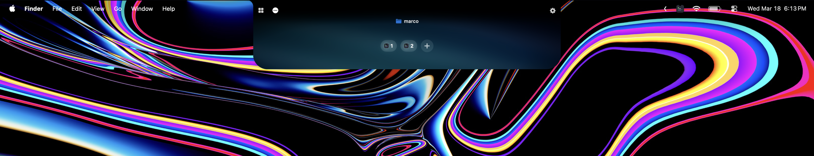
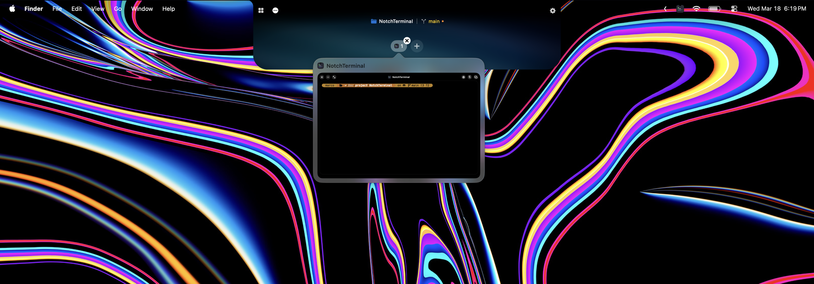
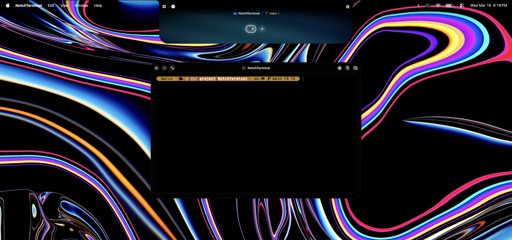

# NotchTerminal

[](LICENSE)
[]()
[]()

**English** | **Español** | **日本語** | **简体中文** | **Français**

> Coming soon

<p align="center">
  
</p>

**NotchTerminal** is a macOS terminal app built around the notch. Keep terminal access fast, visible, and close to what you're doing, without filling your desktop with extra windows.

---

## Demo


<p align="center">
## Demo

[Watch demo video](https://github.com/iDams/NotchTerminal/raw/refs/heads/main/docs/demo1.mp4)
</p>

---

## Table of Contents

- [Screenshots](#screenshots)
- [Features](#features)
- [Requirements](#requirements)
- [Installation](#installation)
- [Build from Source](#build-from-source)
- [Project Structure](#project-structure)
- [Settings](#settings)
- [Documentation](#documentation)
- [Contributing](#contributing)
- [Credits](#credits)
- [Support](#support)
- [License](#license)

---

## Screenshots

<p align="center">
  
</p>

<p align="center">
  
</p>

---

## Features

### Notch Overlay
- Expands on hover
- Works across multiple displays
- Compatible with Macs with and without a physical notch
- Shows minimized terminal chips
- Quick actions: `New`, `Reorg`, `Bulk`, `Settings`

### Terminal Windows
- Open/close/minimize/maximize
- Compact mode
- Always on Top toggle
- Dock-to-notch when dragged near the notch
- Drag & drop files/folders (inserts escaped paths)

### Sessions
- Persistence via SwiftData
- Automatic restore on launch: position, size, docked state, compact mode, always-on-top, maximized state

### Developer Utilities
- **Active Ports**: list listening TCP ports, filter, kill processes by PID
- **Storage Analysis**: scan `node_modules`, `DerivedData`, `Pods`, caches, logs, Trash, and more

### Visual Effects
- Aurora background styling
- CRT filter
- Fake Notch glow

### Menu Bar
- Quick access: New Terminal, Show All Windows, Settings, Hide, Quit

### Keyboard Shortcuts
| Shortcut | Action |
|----------|--------|
| `⌘C` / `⌘V` / `⌘A` | Copy / Paste / Select All |
| `⌘K` | Clear buffer |
| `⌘F` | Search |
| `⌘W` | Close session |
| `⌘+` / `⌘-` | Adjust font size |

---

## Requirements

- macOS 14 or later
- Xcode 16+ (for development only)

> The default shell is `/bin/zsh`, available on any clean macOS install.

---

## Installation

> Coming soon

---

## Build from Source

1. Clone the repository:
   ```bash
   git clone https://github.com/marcoastorj/NotchTerminal.git
   cd NotchTerminal
   ```

2. Open `NotchTerminal.xcodeproj`

3. Select scheme `NotchTerminal`

4. Build and run

### Local Code Signing for Contributors

The repository does not include a personal Apple `DEVELOPMENT_TEAM`:

1. Copy `Config/Signing.local.example.xcconfig` to `Config/Signing.local.xcconfig`
2. Replace `YOURTEAMID` with your own Apple Developer team ID
3. Keep `Config/Signing.local.xcconfig` local only (in `.gitignore`)

### Debug Workflow

Debug builds automatically install to `/Applications/NotchTerminal.app` for testing outside Xcode.

---

## Project Structure

```
NotchTerminal/
├── App/                    # App lifecycle
├── Features/
│   ├── Notch/              # Overlay UI, interactions
│   ├── Storage/            # Storage analysis
│   ├── Windows/            # Window manager, terminal
│   └── Persistence/        # SwiftData models
├── Rendering/Metal/        # Shaders and renderers
├── Settings/               # Settings screens
├── Services/               # Helpers and services
└── Assets.xcassets/        # Icons and images
```

---

## Settings

| Section | Main Options |
|---------|--------------|
| **General** | Language, haptics, Dock icon, menu bar icon, hover behavior |
| **Notch** | Per-display enable/disable, X/Y offsets, width, custom Aurora |
| **Appearance** | Padding, chip close on hover, preview on hover, Aurora theme |
| **About** | Show Experimental tab |
| **Experimental** | Drag-to-notch sensitivity, Startup Orb, Fake Notch Glow, CRT Filter |

Supported languages: English, Español, Français, 日本語, 简体中文

---

## Documentation

- Docs index: [`docs/README.md`](docs/README.md)
- Testing: [`docs/quality/`](docs/quality/)
- Localization: [`docs/localization/LOCALIZATION.md`](docs/localization/LOCALIZATION.md)

---

## Contributing

See [`CONTRIBUTING.md`](CONTRIBUTING.md).

---

## Credits

See [`NotchTerminal/Resources/THIRD_PARTY_NOTICES.md`](NotchTerminal/Resources/THIRD_PARTY_NOTICES.md).

Main attributions:
- **SwiftTerm** – terminal emulation (MIT)
- **Port-Killer** – inspiration for the port workflow (MIT)

Brand marks/logos used in the UI belong to their respective owners.

---

## Support

If you'd like to support development:

[](https://buymeacoffee.com/marcoastorj)

<p align="center">
  
</p>

---

## License

[MIT](LICENSE) © 2026 Marco Astorga González

---

<p align="center">
  Made with ❤️ by Marco Astorga González
</p>
