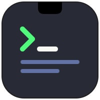
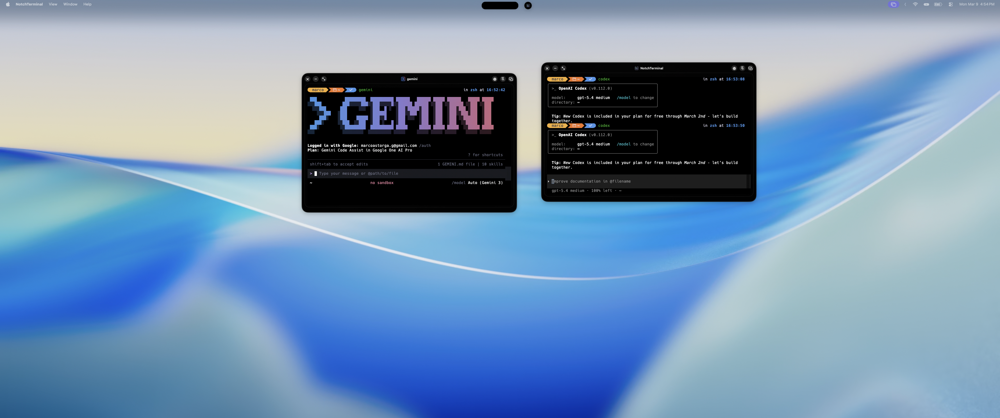
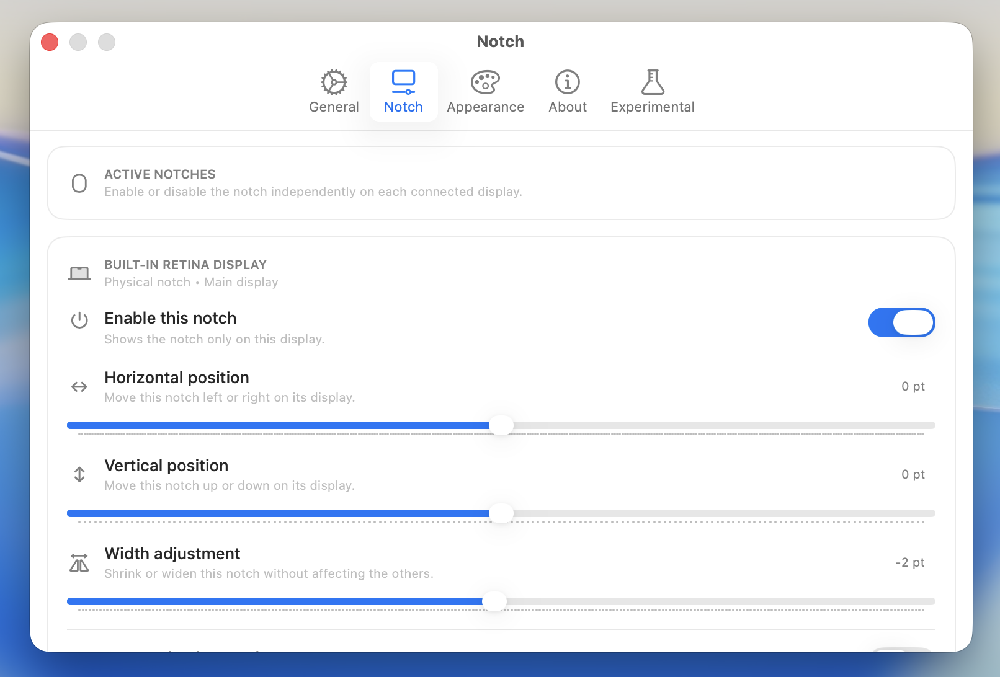
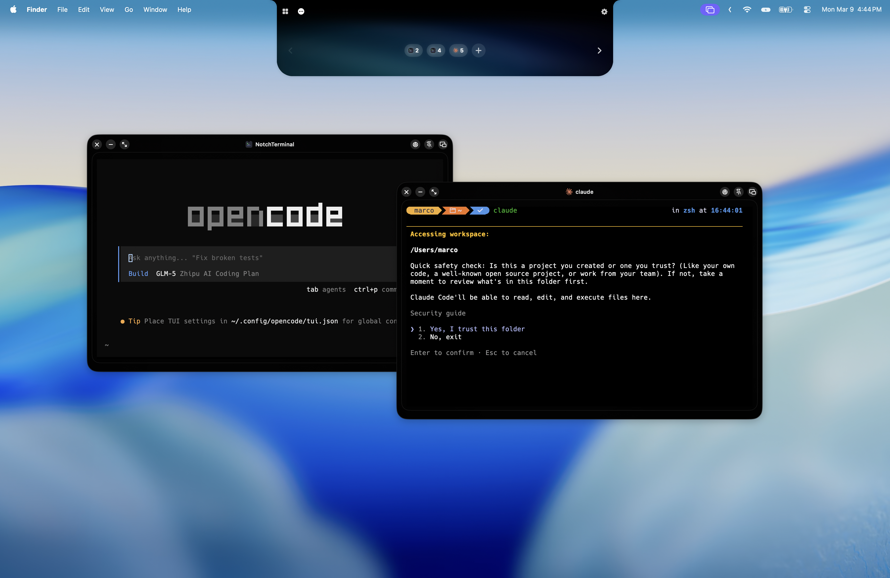

# NotchTerminal

NotchTerminal is a macOS terminal app built around the notch.

  

## Screenshots

The idea is simple: keep terminal access fast, visible, and close to what you are already doing, without filling the desktop with extra windows.

## What It Is

NotchTerminal is primarily for:

- opening and managing terminal windows from the notch area
- restoring active work quickly across displays and sessions
- keeping common terminal actions close at hand while coding
- working on both physical-notch Macs and no-notch displays through the same overlay concept

The rest of the app builds around that core workflow.

## Main Features

### Notch Overlay
- Expands on hover
- Works across multiple displays
- Works on Macs with and without a physical notch
- Shows minimized terminal chips
- Opens quick actions:
  - `New`
  - `Reorg`
  - `Bulk` (`Restore All`, `Minimize All`, `Close All`, `Close All on This Display`)
  - `Settings`

### Look And Feel
- Aurora background styling gives the overlay its signature look
- The overlay is designed to feel at home on Macs with a physical notch while still working well on displays without one

### Terminal Windows
- Open/close/minimize/maximize
- Compact mode
- Always on Top toggle
- Dock-to-notch behavior when dragged near the notch
- Drag and drop folders/files into the terminal (inserts escaped paths)

### Sessions
- Stores terminal sessions via SwiftData
- Restores terminal sessions on launch, including display placement, docked state, sizing, compact mode, always-on-top state, maximize state, and recent project context

### Menu Bar
- Menu bar status item with quick access to:
  - `New Terminal`
  - `Show All Windows`
  - `Settings`
  - `Hide`
  - `Quit`

### Terminal Actions
- Context menu includes:
  - `Copy`
  - `Paste`
  - `Select All`
  - `Clear Buffer`
  - `Search` (sends Ctrl+R)
  - `Close` (sends `exit`)
- Keyboard shortcuts:
  - `⌘C`, `⌘V`, `⌘A`
  - `⌘K` clear
  - `⌘F` search
  - `⌘W` close session
  - `⌘+` / `⌘-` font size

## Developer Utilities

These features are useful extras around the main terminal experience.

### Open Ports Panel
- Lists listening TCP ports
- Search and filter by dev/all
- Kill process by PID from the UI
- Opens from the menu bar icon and can also appear inside terminal windows

### Storage Analysis
- Opens from the menu bar status item
- Scans common space-heavy folders such as `node_modules`, `DerivedData`, `Pods`, `Carthage`, caches, logs, Trash, and old Downloads
- Uses a single native macOS window with category sidebar, filters, search, and bulk cleanup actions
- Warns when folders appear to still be in use before moving them to Trash

## Extra Visual Effects

- CRT filter
- Fake Notch glow

## Requirements

- macOS 14+
- Xcode 16+ (for development)

Runtime note:
- The app defaults to `/bin/zsh`, which is available on a clean macOS install.

## Build and Run

1. Open `NotchTerminal.xcodeproj`
2. Select scheme `NotchTerminal`
3. Build and run

### Local Code Signing for Contributors

This repository does not commit a personal Apple `DEVELOPMENT_TEAM`.

If you need local signing to run or archive the app:

1. Copy `Config/Signing.local.example.xcconfig` to `Config/Signing.local.xcconfig`
2. Replace `YOURTEAMID` with your own Apple Developer team ID
3. Keep `Config/Signing.local.xcconfig` local only

The shared `Config/Signing.xcconfig` includes that file optionally, so collaborators can sign locally without rewriting shared project settings.

### Debug App Install Flow

For that reason, Debug builds now install a stable development copy automatically to:

- `/Applications/NotchTerminal.app`

Current Debug workflow:

1. Build from Xcode as usual
2. The target reinstalls `NotchTerminal.app` automatically
3. If it was already running, the old dev copy is closed first
4. Use `NotchTerminal.app` when testing app behavior outside Xcode's transient bundle

Why this exists:

- A stable app path avoids surprises caused by ephemeral app bundles in `DerivedData`
- This keeps the development loop inside Xcode while avoiding manual copy steps

## Settings Overview

- `General`
  - Language: system default or manual override (`en`, `es`, `fr`, `ja`)
  - Haptics
  - Dock icon toggle
  - Menu bar icon toggle
  - Hover/open behavior and delay
  - Keep open while typing
  - Default terminal width/height
  - Close confirmation behavior
  - Stop running command when closing
  - Quit app action
- `Notch`
  - Per-display notch enable/disable
  - Per-display X/Y offset and width adjustment
  - Per-display custom Aurora background override
- `Appearance`
  - Content padding
  - Chip close button on hover
  - Terminal preview on hover
  - Project Status Card
  - Global Aurora background and theme
- `About`
  - Show Experimental tab
- `Experimental`
  - Hidden by default behind `Show Experimental tab`
  - Drag to Notch and docking sensitivity
  - Startup Orb and its offset tuning
  - Fake Notch Glow and theme
  - CRT Filter

## Project Structure

- `NotchTerminal/App` app lifecycle
- `NotchTerminal/Features/Notch` overlay UI, interactions, and notch actions
- `NotchTerminal/Features/Storage` storage scanning, cleanup actions, and overview UI
- `NotchTerminal/Features/Windows` floating window manager, terminal integration, ports UI, and session/window logic
- `NotchTerminal/Features/Persistence` SwiftData models and session restore helpers
- `NotchTerminal/Rendering/Metal` Metal shaders/renderers
- `NotchTerminal/Settings` settings screens
- `NotchTerminal/Services` helpers/services
- `NotchTerminal/Assets.xcassets` icons/images

## Documentation

- Main docs index: `docs/README.md`
- Quality and testing: `docs/quality/`
- Localization docs: `docs/localization/`

## Credits

See `NotchTerminal/Resources/THIRD_PARTY_NOTICES.md`.

Main attributions:
- SwiftTerm (terminal emulation, MIT)
- Port-Killer inspiration for open-port workflow (MIT)

Brand marks/logos used in UI belong to their respective owners and are used for identification only.

## Support

If you want to support development:

- Buy Me a Coffee: https://buymeacoffee.com/marcoastorj

  

## License

MIT. See `LICENSE`.
